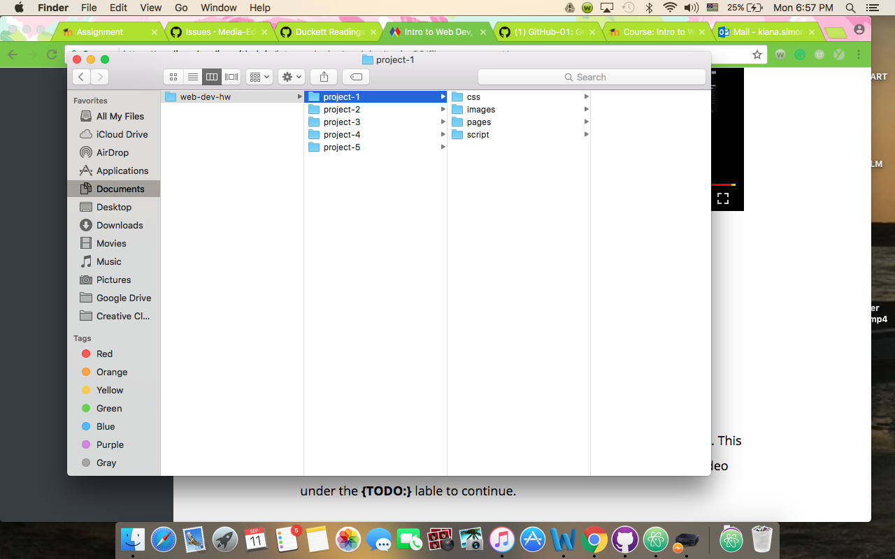

# My First README.md
***
## Kiana Simonson

I am very **overwhelmed** at  *all* the new material I have already learned in just the *first couple weeks*.

I am very amazed at how many things I didn't know about such as:
* what the internet really was and how it worked.
* the World Wide Web and the Internet are two completely different things.

Even though the materials and assignments are a little overwhelming, I'm still very excited for what's to come in this class. Two things I believe that will be beneficial for me no matter what career path I take.
1. Building our own website.
2. Knowing how to manage and maintain our own website.

This will be so valuable knowing later on in life.

[GitHub](http://github.com) is like nothing I've ever used before, as well as Atom. By the end of the semester I will hopefully be a pro using both programs.

 I believe my organizational skills will increasingly get better, even though I would say I'm organized  now.

Looking forward to learning more and hoping I can keep up with the pace.

Snooping weekly report

I choose to snoop on google and their progress. First I looked at April 22, 1999. It was definitely a retro style with plain white background and the normal google logo. It still had the typical search bar but more of a plain look. Then I checked April 22, 2017 and it is completely updated with the google logo being something different everyday. More cookies buttons to click on and a menu bar with almost 10 different options ranging from settings, mail, drive, Youtube, and etc.

The second website I wanted to explore was a boutique that I admire called The Lace Cactus. The woman that owns this boutique has an very inspiring story on how she got started and I love to see how far she's progressed over the years. As of 2017 she was voted the best boutique in Texas. After looking at her website from when she first started it has completely blossomed into an easy and convenient website to use. When she first started back in 2015 she didn't have much decoration added to the website other than the clothes she was selling. Now her website is decorated with more options to click on as well as a new logo. 
