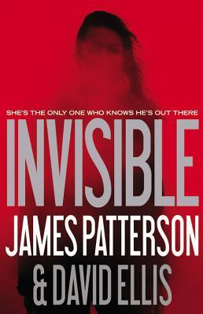

<!DOCTYPE html>
<html>
<head>
    <meta charset="utf-8">
    <title>Invisible</title>
</head>
  <body>
<h1>Kiana Simonson </h1>

<h3> Project 3 Readme </h3>
 

  1. My site will be a book site.
 
  2. Invisible by James Patterson. For my writing example I haven't decided, but it will most likely come from
<a href=" http://www.jamespatterson.com/books/invisible#excerpts">these chapters.</a>
 
  3. I love every book I have read from James Patterson. He really knows how to make a mystery so entertaining. I always have trouble putting his books down. 
  James Patterson started writing at the age of nineteen from Newburgh, New York. Before becoming a writer he was set on track to become a professor and decided this wasn't the lifestyle for him. Invisible is an unbelievale book with a plot twist that will blow your mind. I always ponder on how authors come of with ideas such as these, but their imagination has to be wild.
   
  4. Color pallette:
   
  #ff0000  #000000  #ffffff  #505050
   
  5. I want to go with uneasy pictures that add to the mystery. I will definitely show the book cover for starters.
   
  
  
  
  </body>
</html>
