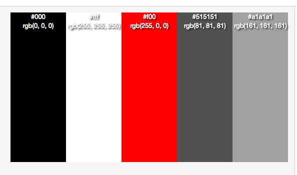
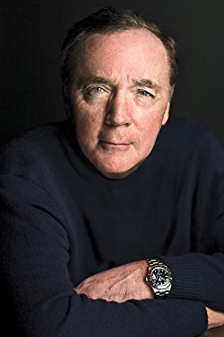

# Kiana Simonson

### Project 3 Readme

  1. My site will be a book site.

  2. Invisible by James Patterson. For my writing example I haven't decided, but it will most likely come from
  [these chapters.](http://www.jamespatterson.com/books/invisible#excerpts)
  I understand this book is also written by David Ellis but I wanted to focus on James Patterson because I admire his work and know more about it.

  3. I love every book I have read from James Patterson. He really knows how to make a mystery so entertaining. I always have trouble putting his books down.

  James Patterson started writing at the age of nineteen from Newburgh, New York. Before becoming a writer he was set on track to become a professor and decided this wasn't the lifestyle for him. Invisible is an unbelievale book with a plot twist that will blow your mind. I always ponder on how authors come of with ideas such as these, but their imagination has to be wild.

  4. Color pallette:

  #ff0000  #000000  #ffffff  #505050 #a0a0a0

  This palette doesn't show the exact colors but close to what I will be using for my website.

  

  5. I want to go with uneasy pictures that add to the mystery. I will definitely show the book cover for starters.

  
  
  
  

I really like the time.com website and I believe it is more of the direction I am headed on how I want to present my website. I always like a pop of color in my outfits, in my jewerly, and I think in media it shines even brighter. An accent color is definitely what I am aiming for with my website.
