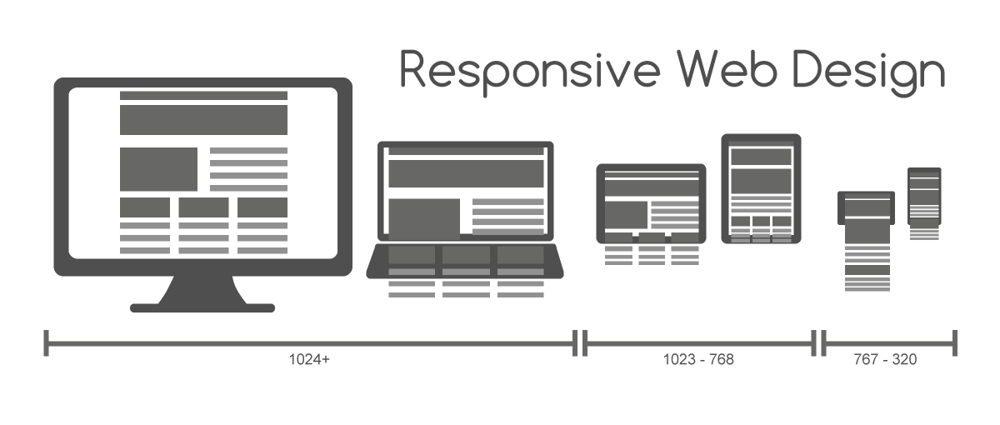

My page aims to deliver a basic definition of responsive web design.

I think the first thing that should catch the eye is the title. Giving a basic understanding of what the entire content on the page is about.

The primary content is about responsive web design and this is why it is the title.

The secondary content is the definitions I put on the page.

#000000  #ffffff  #505050 #a0a0a0

  
